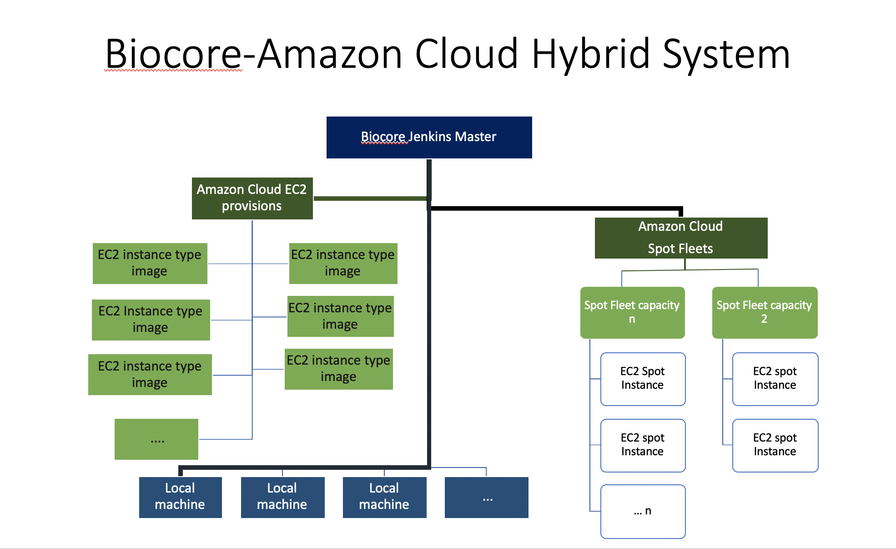
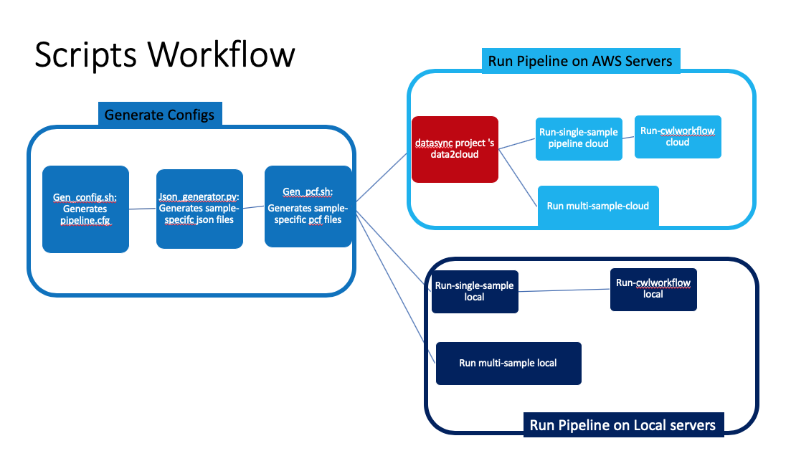

# Biocore On The Amazon Cloud

Biocore uses Jenkins to launch pipeline analysis projects  either on local servers or on the Amazon Cloud servers, or on both. 
Jenkins integrates very well across languages, platforms, and operating systems - Additionally Jenkins is widely documented and open-source software.

Our Jenkins setting consists on A single master server with multiple worker nodes.
Worker nodes are a hybrid of Amazon EC2 instances and MDIBL servers 


# Quick Links

- [Biocore-AWS Hybrid System Overview ](#biocore-aws-hybrid-system-overview)
- [Biocore Pipeline Run Options And Steps](#biocore-pipeline-run-steps)
- [Repository Information Organization](#scripts-and-files-organization)


## Biocore-AWS Hybrid System Overview  


  [](images/biocore-aws-hybrid-system.png)


## Biocore Pipeline Run Steps
  

 [](images/biocore-pipelines-scripts.png)


Depending of the workload, you have these options to run your pipeline :

### Option 1: Run pipelines on AWS cloud servers
### Option 2: Run pipelines on local servers


## Scripts and Files Organization

The root directory is organized as followed:

- README.md	
- [cfgs/ ](#config-files-sub-directory)		
- [docs/](#useful-documents)		
- [images/](#images-sub-directory)	
- [src/](#scripts-sub-directory)
  - [shell/](#shell-scripts)
  - [python/](#python-scripts)
  - [cwl/](#cwl-scripts)
 

### Config files Sub-directory

A set of biocore global settings and   program-specific default command line options.
* **cfgs/**
   - **aws.cfg**	       - connection settings and path to the info on to AWS	servers
   - **jenkins.cfg**    - connetion settings to Jenkins 
   - **biocore.cfg**		        - setting expected structure to biocore info
   - **rna-seq.template.json** - json template for rna-seq pipelines
```
Others: 
   * cutadapt.tool_options.cfg	
   * cwl.tool_options.cfg		
   * bowtie2.aligner_options.cfg	
   * fastqc.tool_options.cfg		
   * trimmomatic.tool_options.cfg
```

### Images Sub-directory
* **images/**  -- static images of the different associated processes

### Scripts Sub-directory

There are three main parts in running the pipeline on the Biocore environment.

- Generating the experiment-level config file (pipeline.cfg)
- Generating sample-specific json and pcf files
- Triggering pipeline nuns 

#### The experiment-level config file Generator

- **Script:  src/shell/gen_config.sh**
```
- What it does: 

generates the main config file(pipeline.cfg) for this project runID. This main config file sets global environment variables specific to this runID and used by different downstream processes. The generated config file is stored under PIPELINE_RESULTS_BASE/PROJECT_TEAM_NAME/PROJECT_NAME/runID/cfgs/

- Usage - either:
 * On the Command :  ./gen_config.sh  PIPELINE_OWNER PROJECT_TEAM_NAME \
          PROJECT_NAME ORGANISM  REF_DATABASE REF_DATABASE_VERSION \ 
         CWL_SCRIPT PIPELINE_PCF_BASE PIPELINE_JSON_BASE \
         PIPELINE_READS_BASE \PIPELINE_RESULTS_BASE

 *  Or Using Jenkins GUI
    ** Log onto to Jenkins 
    ** Run  the job Cwl_Workflows => cwl_workflows => generate-configs => generate-project-config  
       by clicking on “Build with parameters”

Input:
    1) PIPELINE_OWNER:  The username for the owner of the pipeline results directory - Must be a valid username.
    2) PROJECT_TEAM_NAME: the team name associated with this project -  as found under /data/internal
    3) PROJECT_NAME: The project name - as found under /data/internal/team_name/ - according to our standards
    4) ORGANISM: The organism name - according to our standards
    5) REF_DATABASE: The reference database source - according to our standards - see /data/external
    6) REF_DATABASE_VERSION: The reference database version - example 95  for ensembl release 95
    7) CWL_SCRIPT: full path to the cwl script to use for this pipeline
    8) PIPELINE_PCF_BASE: pcf files base - 
        will store/read sample-specifc pcf ffiles under PIPELINE_PCF_BASE/team/project/runID
    9)  PIPELINE_JSON_BASE: json files base  - 
        will store/read sample-specific json files under PIPELINE_JSON_BASE/team/project/runID
    10) PIPELINE_READS_BASE: input reads base - will look for sequence reads under PIPELINE_READS_BASE/team/project/
    11) PIPELINE_RESULTS_BASE: results base - will store results under PIPELINE_RESULTS_BASE/team/project/runID/

Output: 
  1) PIPELINE_RESULTS_BASE/PROJECT_TEAM_NAME/PROJECT_NAME/runID/cfgs/pipeline.cfg 
  2) PIPELINE_RESULTS_BASE/PROJECT_TEAM_NAME/PROJECT_NAME/runID/logs/gen_config.sh.log

Assumptions:

1) PIPELINE_RESULTS_BASE must exist - or the program fails
2) PIPELINE_READS_BASE must exist - or the program fails
3) ORIGINAL_READS_BASE path is /data/internal/team/project/  and must exist
4) DESIGN_FILE must exist -- or program fails
5) PIPELINE_READS_BASE  must exist or the program fails
6) CWL_SCRIPT must exist or the program fails 
7)  /data/scratch/REF_DATABASE-REF_DATABASE_VERSION must exist or the program fails


```

### Sample-specific json file Generator

- **Script:  src/pyhton/json_generator.py**

```
- What it does: 

The tool generates sample-specific json files for a given experiment runID. It uses the json template
in addition to the project config file to generate sample-specific json files.
It gets project global environment variables from the path2project_runID_main_config/cfgs/pipeline.cfg.
Variables of interest for this step:

  1)LOG_BASE
  2)JSON_TEMPLATE
  3)PATH2_JSON_FILES
  4)DESIGN_FILE  
  5)READS_BASE

- Usage - either:
 * On the Command :  python path2/json_generator.py -c path2project_runID_main_config/cfgs/pipeline.cfg 
                       [-j path2project_runID_json_template/cfgs/template.json] [-s fastq]

 * Where:
     -h To show the usage
     -c path2runID/cfgs/pipeline.cfg or --cfg=path2runID/cfgs/pipeline.cfg  ... required, 
     -j path2runID/cfgs/template.json or --jtemp=path2runID/cfgs/template.json ... optional
          (default - get template path from pipeline.cfg), 
     -s fatsq.gz or --suffix=fastq.gz ... optional(default fastq), reads files suffix 
     
 *  Or Using Jenkins GUI
    ** Log onto to Jenkins 
    ** Run  the job Cwl_Workflows => cwl_workflows => generate-configs => generate-json
       by clicking on “Build with parameters”

Example: 
       python path2/json_generator.py  -c path2results/teamName/projectName/runID/cfgs/pipeline.cfg -s fastq
       OR 
       python path2/json_generator.py  -c path2results/teamName/projectName/runID/cfgs/pipeline.cfg 
                    -j path2results/teamName/projectName/runID/cfgs/template.json
       OR
       python path2/json_generator.py  --cfg=path2results/teamName/projectName/runID/cfgs/pipeline.cfg 
       
Output: 
   1) Generates sample-specific json files under PATH2_JSON_FILES/PROJECT_TEAM_NAME/PROJECT_NAME/runID/
   2) Generates a log file for this step under LOG_BASE/

Assumptions:
       1) User has full permission to create sample-specific json files
       2) The json template has been generated in the same directory as the pipeline.cfg file

```

### Sample-specific pcf file Generator

- **Script:  src/shell/gen_pcf.sh**
```

- What It Does: 
    generates a pcf file for each sample listed in the design file. If the sampleID is specified, 
    then only the pcf file for that sample is generated.

- Usage - either:
 * On the Command :  ./gen_pcf.sh path2runID/cfgs/pipeline.cfg [sampleID]

 *  Or Using Jenkins GUI
    ** Log onto to Jenkins 
    ** Run  the job Cwl_Workflows => cwl_workflows => generate-configs => generate-pipeline-pcf
       by clicking on “Build with parameters”
 
 * Where:
     path2runID/cfgs/pipeline.cfg:  Required - is the full path to this pipeline config file.
     sampleID:  Optional - is the sample Id as found in the experiment design file.
                Default, generates a pcf file for each sample listed in the design file.  
```

### Multi-samples pipeline run trigger)

- **Script:  src/shell/submit_multi_pcf.sh**

```
What it does: The program triggers a pipeline build on Jenkins for each sample listed in the design file(Example 1) 
              or for the specified sampleID 
              
Usage - either: 
   ./submit_multi_pcf.sh path2runID/cfgs/pipeline.cfg [server_type] [sampleID]"
Where:
   pipeline.cfg: Required - is the full path to your pipeline project config file.
                 The pipeline config file is generated by running the program gen_config.sh
   server_type:  Required - Platform [cloud | local] to launch the pipelines - by default local servers are used.
   sampleID:     Optional - is the sample Id as found in the experiment design file.
                 Default, triggers a pipeline run for each sample listed in the design file.
   
Example 1: ./submit_multi_pcf.sh path2runID/cfgs/pipeline.cfg"
   

```
## Appendix 

1) https://docs.aws.amazon.com/AmazonVPC/latest/UserGuide/VPC_Introduction.html
2) https://docs.aws.amazon.com/AWSEC2/latest/UserGuide/using-spot-instances.html?icmpid=docs_ec2_console
3) https://aws.amazon.com/ec2/instance-types/
4) https://aws.amazon.com/efs/pricing/
5) https://docs.aws.amazon.com/AWSEC2/latest/WindowsGuide/instance-optimize-cpu.html#instance-specify-cpu-options
6) https://docs.aws.amazon.com/cli/latest/userguide/awscli-install-linux.html
7)https://docs.aws.amazon.com/AWSGettingStartedContinuousDeliveryPipeline/latest/GettingStarted/CICD_Jenkins_Pipeline.html#step-1-build-an-ecs-cluster

8) https://docs.aws.amazon.com/cli/latest/userguide/cli-chap-getting-started.html
9) https://docs.aws.amazon.com/AWSEC2/latest/UserGuide/AccessingInstancesLinux.html

## Continuous Integration (CI)
## Continuous Deployment (CD)
With continuous deployment, revisions are deployed to a production environment automatically without explicit approval from a developer, making the entire software release process automated. This, in turn, allows for the product to be in front of its customers early on, and for feedback to start coming back to the development teams.

