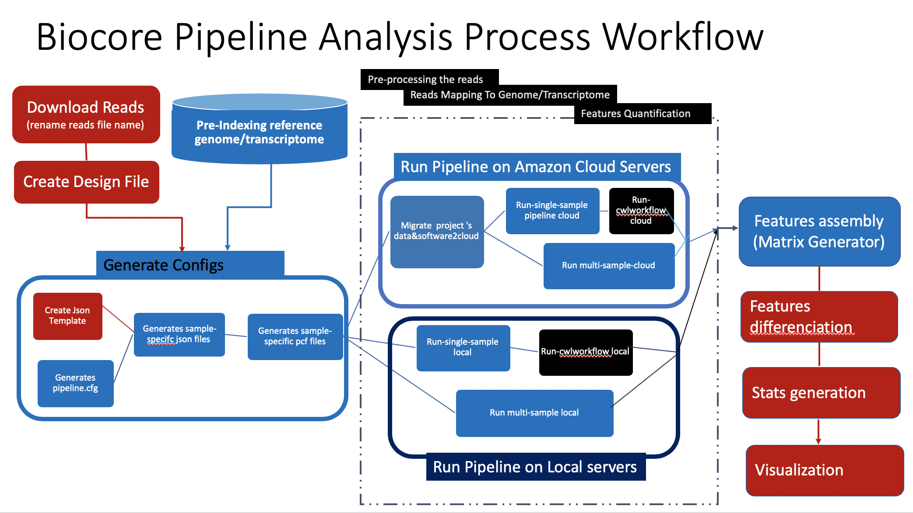

# Biocore On The Amazon Cloud

Biocore uses Jenkins to launch pipeline analysis projects  either on local servers or on the Amazon Cloud servers, or on both. 
Jenkins integrates very well across languages, platforms, and operating systems - Additionally Jenkins is widely documented and open-source software.

Our Jenkins setting consists on A single master server with multiple worker nodes.
Worker nodes are a hybrid of Amazon EC2 instances and MDIBL servers 


# Quick Links

- [Biocore-AWS Hybrid System Overview ](#biocore-aws-hybrid-system-overview)
- [Biocore Pipeline Run Options And Steps](#biocore-pipeline-run-steps)
- [Repository Information Organization](#scripts-and-files-organization)


## Biocore-AWS Hybrid System Overview  


  [](images/biocore-aws-hybrid-system.png)


## Biocore Pipeline Run Steps
  

 [](images/biocore-pipelines-scripts.png)


Depending of the workload, you have these options to run your pipeline :

### Option 1: Run pipelines on AWS cloud servers
### Option 2: Run pipelines on local servers


## Scripts and Files Organization

The root directory is organized as followed:

- README.md	
- [cfgs/ ](#config-files-sub-directory)		
- [docs/](#useful-documents)		
- [images/](#images-sub-directory)	
- [src/](#scripts-sub-directory)
  - [shell/](#shell-scripts)
  - [python/](#python-scripts)
  - [cwl/](#cwl-scripts)
 

### Config files Sub-directory

A set of biocore global settings and   program-specific default command line options.
* **cfgs/**
   - **aws.cfg**	       - connection settings and path to the info on to AWS	servers
   - **jenkins.cfg**    - connection settings to Jenkins 
   - **biocore.cfg**		        - setting expected structure to biocore info
   - **rna-seq.template.json** - json template for rna-seq pipelines
```
Others: 
   * cutadapt.tool_options.cfg	
   * cwl.tool_options.cfg		
   * bowtie2.aligner_options.cfg	
   * fastqc.tool_options.cfg		
   * trimmomatic.tool_options.cfg
```

### Images Sub-directory
* **images/**  -- static images of the different associated processes

### Scripts Sub-directory
  
