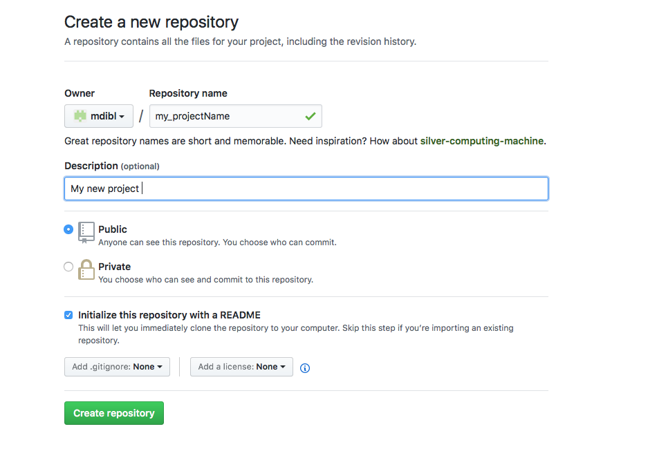

# Basic Github Tutorial

- [What's A Repository](#what-is-a-repository)
- [How To Create A New Repository](#how-to-create-a-new-repository)
- [How to clone a repository locally from the command line](#how-to-clone-a-repository-locally-from-the-command-line)
- [How to Push your local changes to git server](#how-to-push-your-local-changes-to-git-server)
- [How to add a new file to your repos](#how-to-add-a-new-file-to-your-repos)
- [How to add a new sub-directory to your repos](#how-to-add-a-new-sub-directory-to-your-repos)
- [How to Create a tag](#how-to-create-a-tag)
- [How to create a branch](#how-to-create-a-branch)
- [Merging a Branch to master](#merging-a-branch-to-master)
- [Removing a Branch](#removing-a-branch)

## What Is A Repository?
A repository is just another way to call your project. It's a project.

## How To Create A New Repository

Very simple:
   - Access MDIBL github account - https://github.com/mdibl
   - Click on "New" then:
      * Enter the repository Name
      * Enter a brief description of your project (optional)
      * Select the type of the repository (public/private)
      * Check the "initializethis repository with a README"
      * Click on "Create repository"
  
  See:
     [](how2createArepos.png)
  
## How to clone a repository locally from the command line

Suppose you want a copy of the documentation repository on your local machine  - Here is 
how you can get it loccally from the command line:

```bash
   Note: Assuming git is already installed on your local system. To check,
   Open a terminal and run the command: which git
   Example:
      MDIBL Bella:projects lhutchin$ which git
        /usr/bin/git
  
  Now that git is installed, I can now git clone the repos.
  Command: git clone https://github.com/mdibl/documentation.git
  Eaxmple:
       MDIBL Bella:projects lhutchin$ git clone https://github.com/mdibl/documentation.git
       
        output:
           Cloning into 'documentation'...
           remote: Counting objects: 381, done.
           remote: Compressing objects: 100% (30/30), done.
           remote: Total 381 (delta 11), reused 0 (delta 0), pack-reused 351
           Receiving objects: 100% (381/381), 405.35 KiB | 0 bytes/s, done.
           Resolving deltas: 100% (146/146), done. 
```

The git clone command create a local directory for your repos - you can work locally, save, commit, and push your changes
to git server as needed.

## How to Push your local changes to git server

Supposed you modified an existing file - for example the main README.md file. To push these changes
to git server, follow these steps.

```bash
  Steps:
      1) cd to your local repos directory 
      2) run the command: git add README.md
      3) run the command: git commit -m"your short message" README.md
      4) run the command: git push
    
```
## How to add a new file to your repos

Supposed you want to add a new file to your repos and push this new file to git server. To push these changes
to git server, follow these steps.

```bash
  Steps:
      1) cd to your local repos directory 
      2) create the new file - say my_new_file
      2) run the command: git add my_new_file
      3) run the command: git commit -m"your short message" my_new_file
      4) run the command: git push
```    
## How to add a new sub-directory to your repos
Supposed you want to add a new sub-directory containing files to your repos - cd to your local repos then follow these steps.


```bash
  Steps:
      1) cd to your local repos directory 
      2) add the new sub-directory - say my_sub_dir (cp -R path2/my_sub_dir .)
      2) run the command: git add my_sub_dir
      3) run the command: git commit -m"your short message" my_sub_dir
      4) run the command: git push
```
You could also create my_sub_dir first then add files to it then proceed with steps 2) to 4) above.

## How to Create a tag

Tags are created to timestamp specific software changes. 
For example: To create a 1.1.0 tag for your git repos,
Do the following:

```bash
cd to_your_repos

 git tag 1.1.0
 
Once the tag is created, you need to push the tag up to the master repository. 
By itself, push doesn't send the tags up. 

To push the new tag, run the following command:

git push --tags

If you don't want to push all your tags, you can also be specific:
Example:

git push origin tag 1.1.0

To check and confirm remote tags, the command is

git tag -l

```

## How to Create a Branch
### Command line option:
* ssh to your machine
* git clone your repos
* cd to your repos
* git branch (to check existing branches)
* git checkout -b my_branch    --- this creates a new local branch 
* git branch (to check if my_branch was created and is the active branche)
* git add --all (optional - to stage current working environment)
* git commit -m"commit message"
* git push origin my_branch    --- this pushes the my_branch to the server

## Merging a Branch to master
### Command line option:
* ssh to your machine
* git clone your repos
* cd to your repos
* git checkout master
* git merge my_branch 
* git push origin master (push changes to remote server)

## Removing a Branch
### Command line option:
* ssh to your machine
* git clone your repos
* cd to your repos and make sure you are not on the branch you want to remove then

#### To delete a local branch use one of the following:
* git branch -d branch_name
* git branch -D branch_name

#### Delete Remote Branch
* git push origin --delete branch_name

### Appendix
```
git branch -a   (will display local and remote)

## Set local branch to track remote branch
git branch --set-upstream-to=origin/develop develop
    Branch develop set up to track remote branch develop from origin.
    
## Find out which remote branch a local branch is tracking
-bash-4.2$ git branch -vv
  output: 
  develop cb2d573 [origin/develop] rsync test
  * master  cb2d573 [origin/master] rsync test
```
